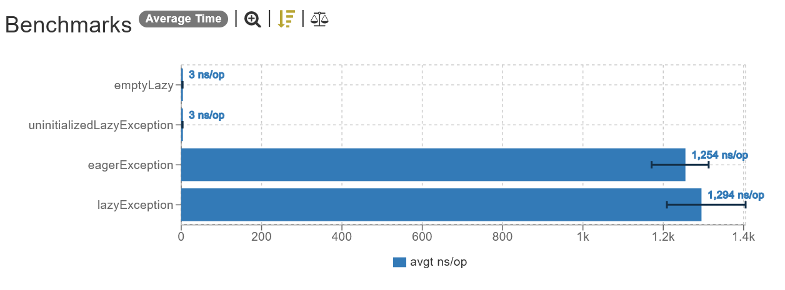

# KotlinBenchmarkJMH

Benchmark setup for code already configured for ease of use.

## Motivation

Benchmarking can be hard, especially if you are new and don't know how to properly configure the JVM benchmark framework [JMH](https://github.com/openjdk/jmh#readme).

It took me some time and a lot of reading to figure out exactly how to setup the framework, hence why I thought that others might also have struggled with this exact problem, and might have even given up because of the challenge that this task proved to be.

By providing this configured JMH setup, I hope it inspires more developers to enter the world of benchmarking, so they learn more about the code they write every day and are able to take intelligent decisions based on data rather than guessing (how many times have you thought "This other way the code *might* run faster" but you had no tools to verify your supposition?).

## How to use

Execute `jmh` Gradle task by running

```bash
./gradlew jmh
```

or directly on your IDE by executing the aforementioned Gradle task.

### Watch for

When executing the tasks on your IDE, **do not** run it on *debug mode* to avoid bottlenecking your tests by having your IDE set up a java agent on the code to enable debug functionalities like break points. When I tested this on IntelliJ IDEA 2022.2.3, the performance penalty by running the benchmark on debug mode was on the scale of ~**10 times** worse performance.

## Where do I see the results

The benchmarks results are saved in three different places:

### Text
- Your terminal, when the execution ends (text only).
- A copy of what is displayed on the terminal is saved to the file `build/results/jmh/humanResults.txt`.

### Graph

- A visual, graphic version is saved on `build/results/jmh/html/index.html`, which generates a pretty bar graph that makes the task of comparing differences and visualizing the timings much easier. The generated graphs look like this:




## License

This project is licensed under [MIT License](LICENSE).
