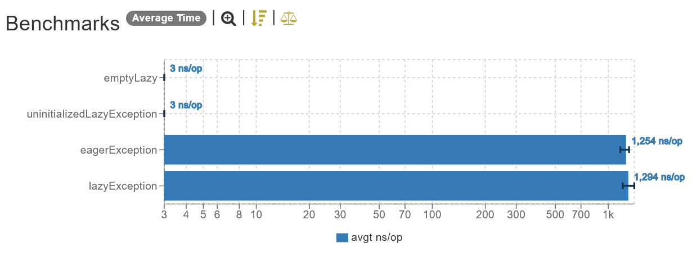
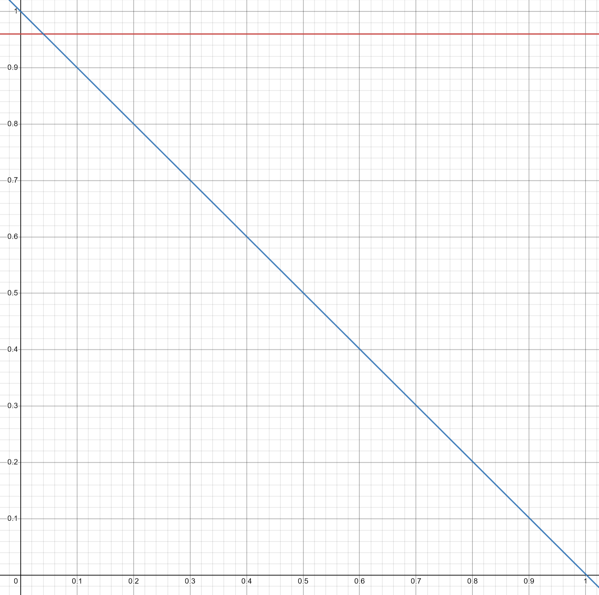
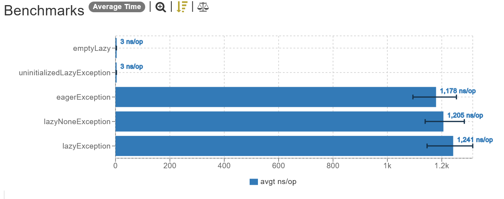

# Is it worth to wrap exceptions in lazy?

## Scenario

Imagine you have this code.

```kt
fun compute() {
    if (!somePrecondition) {
        throw SomeException("message")
    }

    // Do something

    if (!anotherPrecondition) {
        throw SomeException("message")
    }

    return result
}
```

You then think "Hmm, I should not repeat the same code more than once", then you naively make a change in an attempt to optimize the method readability.

```kt
fun compute() {
    // Naive optimization
    val exception = SomeException("message")

    if (!somePrecondition) {
        throw exception
    }

    // Do something

    if (!anotherPrecondition) {
        throw exception
    }

    return result
}
```

While this code us certainly better to read, it is far from optimal from a performance standpoint. The instantiation of `Exception` is **very** expensive because it calls `Throwable.fillInStackTrace()`, a `protected` method that has to traverse all the [method call stack](https://www.oreilly.com/library/view/javatm-how-to/9780133813036/ch06lev2sec35.html), collecting useful data about each entry on it (like method names, parameters, line, etc).

Knowing about this, you changed the previous code.

```kt
fun compute() {
    // Best optimization most of the time
    val exception by lazy { SomeException("message") }

    if (!somePrecondition) {
        throw exception
    }

    // Do something

    if (!anotherPrecondition) {
        throw exception
    }

    return result
}
```

## Results

### Linear

_Linear scale (lower is better)._

### Logarithm


_Logarithm scale (lower is better)._

## Conclusion

So, is it worth it? I would say most of the time **yes**, it is 100% worth it.

By the numbers gathered on the benchmark, it can be extrapolated that in order for this optimization to make sense, your code should succeed (that is, not throw/fail) at least `3%`. If you can guarantee that your code succeeds is at least this much, then wrapping the exception in a `Lazy` makes sense from a performance standpoint.

This value was calculated using an Operations Research (OR) technique called _Simplex_ to find the point where one approach surpasses the other.



### Subtitle

- **X axis:** method success rate
- **Y axis:** average time expended creating the exception **(less is better)**
- **Blue Line:** lazy approach
- **Red Line:** eager approach

By looking at the graph, it becomes obvious that the lazy approach surpasses the eager approach very early on (at only 3% success rate!), so unless the reason of your method to exist is to throw an exception, you're probably better off just wrapping them on `Lazy` when you need to re-use them in multiple places inside a method.

## Extra

The code presented here can be optimized in certain scenarios. For instance, if you don't need thread safety inside the method, that is, you are not doing any kind of async/parallel processing that throws the exception, you could disable the thread safety of the factory method `lazy`.

```kt
fun compute() {
    // factory method 'lazy' is thread-safe by default, if you don't need
    // thread-safety, you can disable it

    // thread-safe
    val exception by lazy { SomeException("message") }

    // not thread-safe
    val exception by lazy(LazyThreadSafetyMode.NONE) { SomeException("message") }

    //...
}
```
### Benchmark

_Linear scale (lower is better)._

### Conclusion

It can be seen on the benchmark that disabling `lazy` thread-safety can squeeze out some extra performance (on average `-40ns` on this setup). This is because Lazy's thread-safety is achieved through use of Java's [`syncronized`](https://www.baeldung.com/java-synchronized) block, which works really well when it comes to thread-safety, but has a side effect of slowing down our programs as consequence of the lock that has to be acquired before and released after the method is executed.

## Versions

| Dependency | Version         |
|------------|-----------------|
| Java       | 17 (GraalVM EE) |
| Kotlin     | 1.7.20          |
