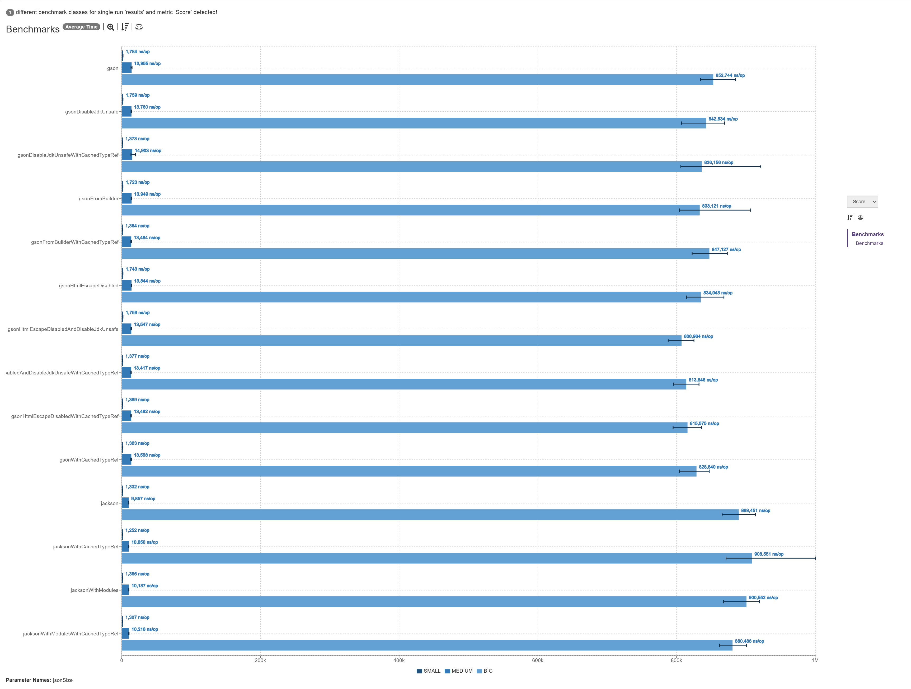
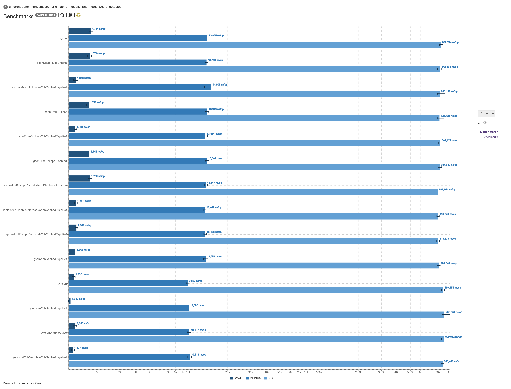

## Java 17 (GraalVM EE)

### Linear

_Linear scale (lower is better)._

### Logarithm

_Logarithm scale (lower is better)._

## Versions

| Dependency | Version |
|------------|---------|
| Kotlin     | 1.7.20  |
| Jackson    | 2.13.4  |
| Gson       | 2.10    |

## Conclusion

Jackson was overall faster for **small** and **medium** JSONs, but Gson was faster for **big** JSONs.

Caching their _type references_ seems didn't do much, if any, for performance.

### Jackson

Adding the standard jackson modules to `ObjectMapper` did not seem to slow it down, but that might be cause the test was not mapping the json to an actual Java class, but instead just to generic, vanilla Java types.

### Gson

Disabling its html escape did not seem to speed it up.
