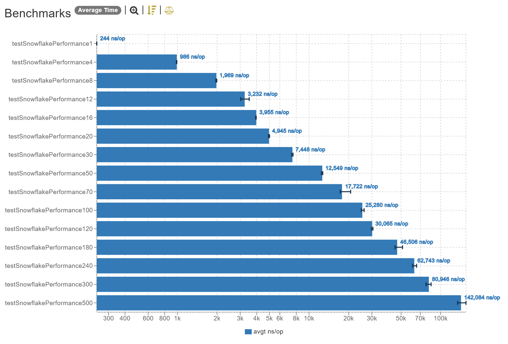

## Java 17 (Temurin)

### Introducing

When I heard about Twitter's solution for generating sequential IDs, [Snowflake](https://github.com/twitter-archive/snowflake/tree/snowflake-2010), I was really impressed and thought: "finally a decentralized way of generating IDs that I can use in many places".

But then it got me thinking about performance and stuff, so I wrote this simple benchmark to test the performance in various concurrency scenarios.

The class used for the benchmarks is simply a port of callicoder's [Java Snowflake](https://github.com/callicoder/java-snowflake) to Kotlin. The test started with a single thread, and ramped up until 500 concurrent threads (the name pattern used in the benchmark is `testSlowflakePerformance[thread_amount]`).

## Results

### Linear

_Linear scale (lower is better)._

### Logarithm

_Logarithm scale (lower is better)._

## Conclusion

Let's first take performance out of the way.

### Performance

It can be seen that increasing the number of concurrent threads cause a spike in the latency. With a single thread, the average time was `244ns` (a pretty good number), but as the number of concurrent threads increase, the performance degrades.

Also, it can be seen that the more threads are added, the more performance is lost per thread added. With 500 concurrent threads, the generation of the sequential id takes in average `142μs` (about x582 slower than with a single thread).

Though, it could be argued that Java's `Snowflake` implementation supports up to `1024` instances (that can be composed into a shard), so this degradation is not an issue because the application can be scaled horizontally, greatly minimizing the performance degradation.

### Usability

This method of generating sequential IDs is very interesting, all things considered. Even the worst case scenario (500 concurrent threads) still managed to present a pretty reasonable timing, especially when we consider that this is being used to generate a unique sequential ID to be used as the ID of some data in a database, and that the usual ID generation method for SQL databases is much, much slower than this one.

I can totally see it being used in production as long as the project requirements align with what `Snowflake` can do, and can handle the drawbacks presented.

## Versions

| Dependency | Version      |
|------------|--------------|
| Java       | 17 (Temurin) |
| Kotlin     | 1.7.21       |
| JMH        | 0.6.8        |
